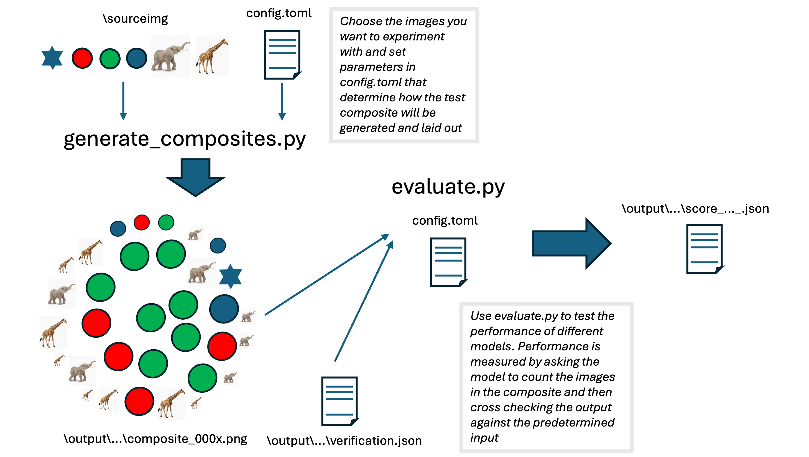

# llm-tester

A two-stage pipeline for testing how well LLMs can count objects in images. This code was generated using Claude Code, and it's provided under an MIT license (see LICENSE) 

1. **`generate_composites.py`** — creates composite images containing pseudo-randomly distributed instances of your source objects, plus a `validation.json` ground-truth file.
2. **`evaluate.py`** — submits those images to an LLM and scores the responses against the ground truth.

## Requirements

- Python 3.11+
- [uv](https://docs.astral.sh/uv/) for dependency management

## Setup

```bash
uv sync
```

Place your source images (PNG, JPEG, or GIF) in a folder called `sourceimg/`:

```
llm-tester/
├── generate_composites.py
├── evaluate.py
├── llm_clients.py
├── config.toml
├── sourceimg/
│   ├── elephant.png
│   ├── giraffe.jpg
│   └── circle.png
└── output/               # created automatically
```


### API keys

Set the relevant environment variable for the provider you intend to use:

| Provider | Environment variable |
|----------|----------------------|
| Anthropic | `ANTHROPIC_API_KEY` |
| OpenAI | `OPENAI_API_KEY` |
| Google | `GEMINI_API_KEY` |

**Option 1 — export in your shell session:**

```bash
export ANTHROPIC_API_KEY="sk-ant-..."
export OPENAI_API_KEY="sk-..."
export GEMINI_API_KEY="AIza..."
```

You only need to set the variable for the provider you're using. Add the line to your `~/.zshrc` or `~/.bashrc` to make it permanent.

**Option 2 — `.env` file (recommended for local development):**

Create a `.env` file in the project root:

```
ANTHROPIC_API_KEY=sk-ant-...
OPENAI_API_KEY=sk-...
GEMINI_API_KEY=AIza...
```

Then load it before running:

```bash
set -a && source .env && set +a
uv run evaluate.py config.toml
```

Or use `uv run --env-file .env evaluate.py config.toml` if your `uv` version supports `--env-file`.

> **Note:** Never commit your `.env` file. Add it to `.gitignore`:
> ```bash
> echo ".env" >> .gitignore
> ```

**Option 3 — inline in `config.toml` (not recommended):**

You can also set `api_key` directly in the `[model]` section of `config.toml`, but avoid committing that file with a real key in it.

```toml
[model]
provider = "anthropic"
api_key  = "sk-ant-..."   # omit this line and use an env var instead
```

---

## Stage 1 — Generate composite images

```bash
uv run generate_composites.py --noobjects <N> --format <fmt> --numbout <N> [options]
```

### Required flags

| Flag | Description |
|------|-------------|
| `--noobjects N` | Total number of objects placed in each composite image |
| `--format fmt` | Output format: `png`, `jpg`, `jpeg`, `gif`, or `pdf` |
| `--numbout N` | How many composite images to generate |

### Optional flags

| Flag | Default | Description |
|------|---------|-------------|
| `--layout` | `grid` | Placement style: `grid`, `random`, or `spiral` |
| `--target name` | — | Fix one image type as the "target" (stem name, e.g. `elephant`). Must be used with `--numtarget`. |
| `--numtarget N` | — | Number of target instances fixed in every composite. The remaining slots are filled randomly from the other images. Must be used with `--target`. |
| `--sourcedir path` | `sourceimg` | Directory containing source images |
| `--canvas WxH` | `1200x900` | Canvas size in pixels |
| `--seed N` | — | Integer seed for reproducible output |

### Layout modes

| Mode | Behaviour |
|------|-----------|
| `grid` | Objects arranged in a regular grid with slight random jitter |
| `random` | Objects scattered at random positions; retries placement to minimise overlap |
| `spiral` | Objects follow an Archimedean spiral outward from the canvas centre |

### Output

Images and a ground-truth file are written to `output/<format>_<numbout>_<noobjects>/`:

```
output/png_10_4/
├── composite_0001.png
├── composite_0002.png
├── ...
└── validation.json
```

`validation.json` is a JSON array with one record per image:

```json
[
  {"filename": "composite_0001.png", "circle": 2, "elephant": 1, "giraffe": 1},
  {"filename": "composite_0002.png", "circle": 0, "elephant": 3, "giraffe": 1}
]
```

### Examples

```bash
# 10 PNG composites, 4 objects each, default grid layout
uv run generate_composites.py --noobjects 4 --format png --numbout 10

# Spiral layout, larger canvas
uv run generate_composites.py --noobjects 8 --format jpg --numbout 20 \
    --layout spiral --canvas 1600x1200

# Fix exactly 8 elephants per composite, fill remaining 12 randomly
uv run generate_composites.py --noobjects 20 --format png --numbout 50 \
    --target elephant --numtarget 8 --seed 42

# Random scatter layout, PDF output
uv run generate_composites.py --noobjects 6 --format pdf --numbout 5 \
    --layout random
```

---

## Stage 2 — Evaluate with an LLM

### Configuration

Copy and edit `config.toml`:

```toml
[model]
# Provider: anthropic, openai, or google
provider = "google"
# Model name — omit to use the provider default
name = "gemini-2.0-flash"
# api_key — omit to read from the environment variable

[evaluation]
# Directory produced by generate_composites.py (must contain validation.json)
composite_dir = "output/png_10_4"

# Optional: marks one object type as the "target" in score output
# target = "elephant"

# Prompt sent to the model with each image.
# The model must return a JSON object: {"circle": 3, "elephant": 2, ...}
prompt = """
Look at this image carefully and count every distinct object type you can see.

Return ONLY a valid JSON object — no explanation, no markdown — where each key
is the object name (lowercase) and each value is the integer count of that
object in the image.

Example response format:
{"circle": 3, "elephant": 2, "giraffe": 1}
"""

[output]
# Defaults to score-<model-name>.json inside composite_dir
# score_file = "score.json"
```

### Provider defaults

| Provider | Default model |
|----------|---------------|
| Anthropic | `claude-opus-4-6` |
| OpenAI | `gpt-4o` |
| Google | `gemini-2.0-flash` |

### Run

```bash
uv run evaluate.py config.toml
```

### Output

Results are written to `<composite_dir>/score-<model-name>.json` — one record per image plus a `__summary__` record at the end:

```json
[
  {
    "filename": "composite_0001.png",
    "predicted": {"circle": 3, "elephant": 2},
    "actual":    {"circle": 5, "elephant": 2},
    "circle": 0.6,
    "elephant": 1.0,
    "target": 1.0,
    "overall": 0.8
  },
  {
    "filename": "__summary__",
    "total_images": 10,
    "circle": 0.75,
    "elephant": 0.8,
    "target": 0.8,
    "overall": 0.775
  }
]
```

### Scoring

Each object is scored with partial credit: `1 - |predicted - actual| / actual`, clamped to `[0, 1]`.

| Predicted | Actual | Score |
|-----------|--------|-------|
| 23 | 23 | 1.0 |
| 20 | 23 | 0.87 |
| 30 | 23 | 0.70 |
| 0 | 23 | 0.0 |

The `overall` score per image is the mean across all object types. The `__summary__` record averages each metric across all evaluated images.
